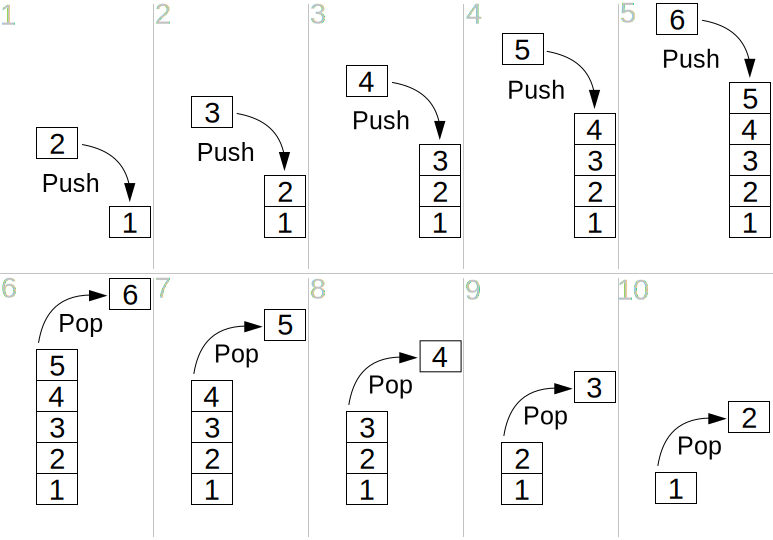

> 패스트캠퍼스 - 컴퓨터 공학 전공 필수 올인원 패키지 Onlne. 강의 내용 정리.

 

# 기본적인 자료구조들

## 선형 구조

- 배열 (Array)
- 연결리스트 (Linked List)
- 스택 (Stack)
- 큐 (Queue)

## 비선형 구조

- 트리 (Tree)
- 그래프 (Graph)

 
 

# 1. 연결 리스트(Linked List) (vs 배열)

- 연결 리스트는 데이터를 **선형적**으로 저장하고 처리하는 한 방법.
- 기존에 배열을 이용했을 때보다 **삽입/삭제**가 많은 경우 **효율적**.
- 다만 **특정 인덱스에 바로 참조해야 할 때가 많다면 배열을 이용**하는 것이 효율적.

## 배열 기반 리스트의 특징

1. 배열로 만들었으므로 **특정한 위치의 원소에 즉시 접근**할 수 있다는 장점이 있다.
2. 데이터가 들어갈 **공간을 미리 메모리에 할당**해야 한다는 단점이 있다.
3. **원하는 위치로의 삽입이나 삭제**가 비효율적이다.

## 연결 리스트의 특징

1. **삽입/삭제**가 배열에 비해서 **간단**하다는 장점이 있다.
2. 배열과 다르게 **특정 인덱스로 즉시 접근이 불가**하며, 원소를 **차례대로 검색**해야 한다.
3. (C언어) 포인터 변수가 사용되므로 **메모리 공간이 낭비**된다.

## 양방향 연결 리스트

- 각 노드가 앞 노드와 뒤 노드의 정보를 저장하고 있다.
- 리스트의 앞에서부터 혹은 뒤에서부터 모두 접근할 수 있다.

 
 

# 2. 스택(Stack)

한 쪽으로 들어가서 같은 쪽으로 나오는 자료구조(Data Structure).
입구 = 출구
수식 계산 등의 알고리즘에서 다방면으로 활용된다.
후입선출 (LIFO, Last in First out)

- PUSH : 스택에 데이터를 넣는다.  
- POP : 스택에서 데이터를 빼낸다.

<a href="https://en.wikipedia.org/wiki/Stack_(abstract_data_type)" target="_blank">
   
</a>

 
 

# 3. 큐(Queue)

뒤 쪽으로 들어가서 앞 쪽으로 나오는 자료구조.
스케줄링, 탐색 알고리즘 등 다방면으로 활용.
선입선출 (FIFO, First in first out)

- PUSH : 큐에 데이터를 넣는다.
- POP : 큐에서 데이터를 빼낸다.

<a href="https://en.wikipedia.org/wiki/Queue_(abstract_data_type)" target="_blank">
   
</a>

 
 

# 출처
[https://fastcampus.co.kr/dev_online_cs](https://fastcampus.co.kr/dev_online_cs)
[https://en.wikipedia.org/wiki/Stack_(abstract_data_type)](https://en.wikipedia.org/wiki/Stack_(abstract_data_type))
[https://en.wikipedia.org/wiki/Queue_(abstract_data_type)](https://en.wikipedia.org/wiki/Queue_(abstract_data_type))