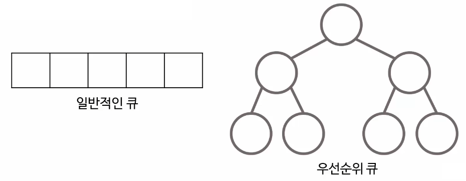
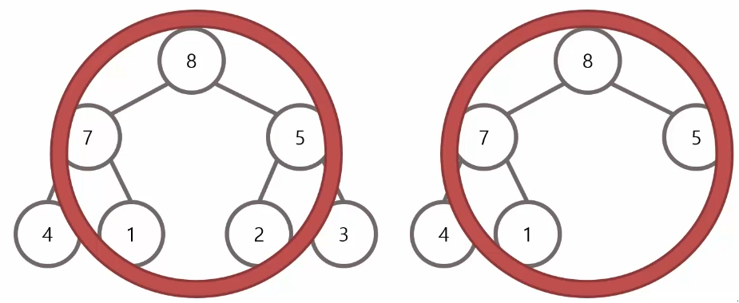
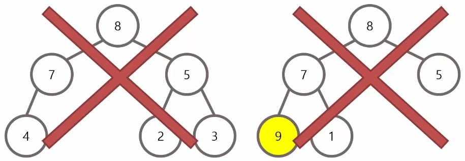
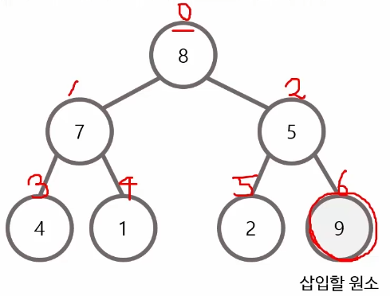
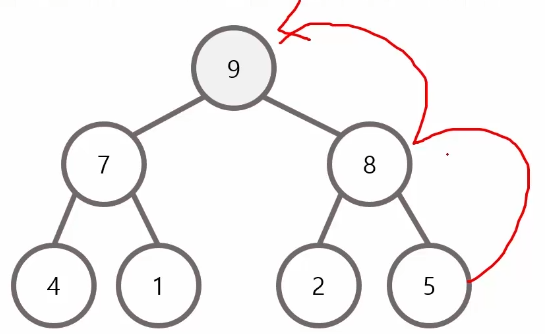
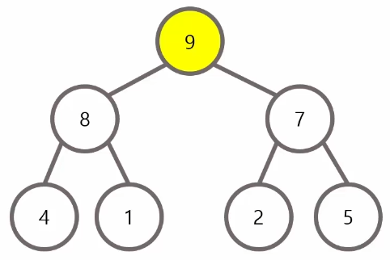
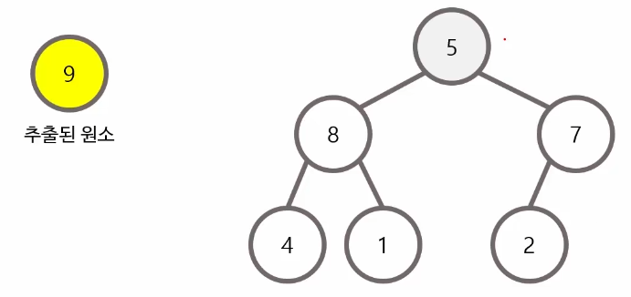
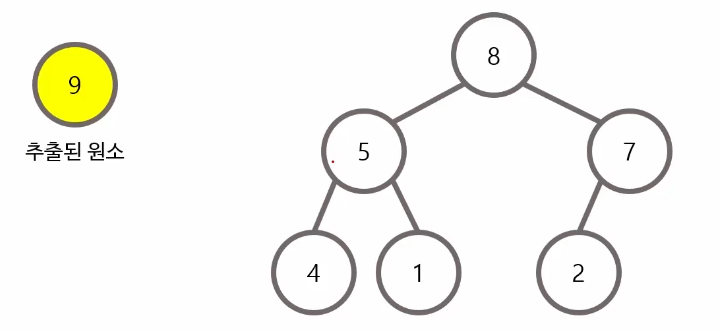

> 패스트캠퍼스 - 컴퓨터 공학 전공 필수 올인원 패키지 Onlne. 강의 내용 정리.

 

# 힙 정렬(Heap Sort)

힙 정렬이란 **우선 순위**를 가진 데이터들을 저장하는 큐(Queue)로,  
**우선순위 큐(Priority Queue)**를 이용한 정렬이다.

- 데이터를 꺼낼 때 **우선 순위가 높은 데이터가 가장 먼저** 나온다.
- 운영체제의 작업 스케줄링, 정렬, 네트워크 관리 등 다양한 기술에 적용되고 있다.
- 일반적인 형태의 큐는 선형적인 형태이지만, 우선순위 큐는 **트리(Tree) 구조**로 보는 것이 합리적이다.

 

- 일반적으로 우선순위 큐는 **최대 힙(Max Heap, 완전 이진 트리 형태의 힙)** 을 이용해 구현 한다.
- 우선순위 큐의 삽입과 삭제는 $O(logN)$의 시간 복잡도를 가진다.
- 따라서, 우선순위 큐를 이용한 정렬은 $O(NlogN)$의 시간 복잡도를 가진다.

 
 

# 최대 힙(Max Heap)

- 부모 노드가 자식 노드보다 값이 큰 **완전 이진 트리**
- 최대 힙의 **루트 노드**는 전체 트리에서 **가장 큰 값**을 가진다.

 
 
좌 : 완전 이진 트리가 아니다.  
우 : 자식 노드의 값이 더 크다.

 
 

# 우선순위 큐의 삽입

- 삽입할 원소는 완전 이진 트리를 유지하는 형태로 순차적으로 삽입된다.  
- 삽입 이후에는 루트 노드까지 거슬러 올라가면서 최대 힙을 구성한다. (상향식)
- 시간복잡도 = $O(logN)$

 
 

 
 

# 우선순위 큐의 삭제

- 루트 노드를 삭제하고, 가장 마지막 원소를 루트 노드의 위치로 옮긴다.  
- 삭제 이후에는 리프 노드까지 내려가면서 최대 힙을 구성한다. (하향식)  

 
 
 

 
 

# 출처
[https://fastcampus.co.kr/dev_online_cs](https://fastcampus.co.kr/dev_online_cs)